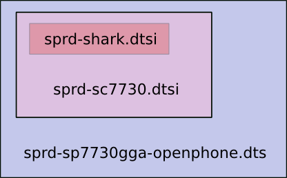

 Sprdlinux Programming Guideline
=====
 前言
-----
编程是一门语言艺术。
程序强调理性逻辑，语言讲究感性表达。
逻辑不正确，程序无法运行；表达不优雅，文章难成佳作。

计算机编程语言诞生于上世纪60年代，历史不足百年，但数百万程序员笔耕不缀，汗牛充栋。举例来看，Linux内核代码历时20多年，已达千万行之巨；sprd kernel 近2年的提交，累计也已有100多万行。
我经历过一个公司，只追求程序运行结果，而忽视代码表达，还说什么“多快好省，坏了再整”——可负责“坏了再整”的那些人，没有一个不边看代码边骂娘的。

编程有如行文，又胜过行文，不仅要结构清晰，逻辑正确，而且要表达优雅，简洁易懂。
外在和内在巧妙融合，理性和感性完美统一，当事物达到这种境界，人们就会称之为艺术。

 命名 (naming)
-----
古语云：名不正，则言不顺；言不顺，则事不成。
虽然是讲治世之道，但细细想来，似乎和编程规律也隐约相通。
kernel累积了千万行代码，万人共同开发。目录名、文件名、函数名、变量名、宏名，乃至作者名，如果各行其事，恐怕早就一团乱麻了。
Sprdlinux社区版约定如下：

#### 公司名 (manufacturer name)

>- 全称 **"Spreadtrum"**
>- 缩写 **"sprd"**

全称仅在注释、描述、介绍中提及公司时使用。
文件、变量、函数中只使用缩写，宏名按惯例使用大写 **“SPRD”**

#### 平台名 (platform name)

我司芯片除ARM核部分，SoC架构基本相似，均源于shark.
名称纷繁的原因多源于市场策略和通信制式的不同。而按SoC惯例，是以cpu为视角来划分。
因此缩减平台名称如下:
>- **shark**: cortex-A7MP4 32bit架构，含原shark, sharkl, tshark, scx15, scx35, pike
>- **shark64**: cortex-A53 64bit架构，原名tsharkl
>- **whale**:  cortex-A53/A7 Big-LITTLE架构

#### 芯片名 (chip name)

>- **主力**芯片型号 **sc####**

因我司芯片型号较为灵活，因此**引脚兼容**、**配置相同**的芯片统一用最初命名的型号代表，称之为该型号兼容。也就是说，没有重新流片的芯片，无论remark成什么型号，都使用最初的型号代表。
比如： sc1234和sc1155仅仅因为销售策略而型号不同，因为sc1234最先使用，sc1155称之为sc1234 compatible，不再另行命名。

#### 板名 (board name)

>- 手机型号**sp####xxx[-....]**

如 sp7730gga, sp7731gea-openphone,

#### 目录名 (directory name)

以下相对于kernel源代码目录树根目录:

- 包含公司名、平台名、芯片名、板名的目录，不应位于第一、二级目录（firmware目录除外）
-  公司名(**sprd**)应用作独立的目录名用以和其他厂商区分，不应和功能连体，尤其是一大堆并列,如当前tsharl_re分支：

**Looks BAD:**
>   ./drivers/media/**sprd_gsp**
    ./drivers/media/**sprd_dma_copy**
    ./drivers/media/**sprd_rotation**
    ./drivers/media/**sprd_isp**
    ./drivers/media/**sprd_dcam**
    ./drivers/media/**sprd_sensor**
    ./drivers/media/**sprd_scale**
    ./drivers/misc/**sprd_vsp**
    ./drivers/misc/**sprd_cproc**
    ./drivers/misc/**sprd_srt**
    ./drivers/misc/**sprd_2351**
    ./drivers/misc/**sprd_jpg**
    ./drivers/misc/**sprd_otp**

**Feel better?**
>   ./drivers/media/**sprd**/gsp
    ./drivers/media/**sprd**/dma_copy
    ./drivers/media/**sprd**/rotation
    ./drivers/media/**sprd**/isp
    ./drivers/media/**sprd**/dcam
    ./drivers/media/**sprd**/sensor
    ./drivers/media/**sprd**/scale
    ./drivers/misc/**sprd**/vsp
    ./drivers/misc/**sprd**/cproc
    ./drivers/misc/**sprd**/srt
    ./drivers/misc/**sprd**/2351
    ./drivers/misc/**sprd**/jpg
    ./drivers/misc/**sprd**/otp

#### 文件名 (file name)

>- dt文件: 公司名 + [ 平台名 | 芯片名 ] + [ 板名 ].[ dtsi | dts ]
 
 例如：
 

----
> Created by Orson Zhai (orson.zhai@gmail.com)
> Written with [StackEdit](https://stackedit.io/).